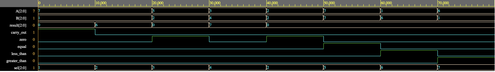

# 3-bit Arithmetic Logic Unit (ALU)

## Description
This project implements a 3-bit Arithmetic Logic Unit (ALU) using Verilog. The ALU performs arithmetic and logical operations determined by a 3-bit select input and sets output flags such as carry out and zero. The design was verified using a testbench to simulate and validate the ALU’s functionality, achieving 100% correctness across 8 different test cases.

## 🔧 Features
- 3-bit inputs and outputs
- Supports addition, subtraction, AND, OR, equal, less than, and greater than operations
- Output flags: Carry out, Zero,

## Operation Select Lines

| Select (3-bit) | Operation              |
|----------------|------------------------|
| 000            | NOT USED               |
| 001            | ADD                    |
| 010            | SUBTRACT               |
| 011            | BITWISE AND            |
| 100            | BITWISE OR             |
| 101            | EQUAL COMPARISON       |
| 110            | LESS THAN COMPARISON   |
| 111            | GREATER THAN COMPARISON|

## 📸 Simulation Waveform

Below is a waveform showing the ALU performing various operations and setting ouput flags:

