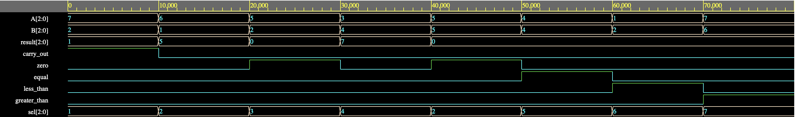

# 3-bit Arithmetic Logic Unit (ALU)

## Description
This project implements a 3-bit Arithmetic Logic Unit (ALU) using Verilog. The ALU performs arithmetic and logical operations determined by a 3-bit select input and sets output flags such as carry out and zero. The design was verified using a testbench to simulate and validate the ALU’s functionality, with all 8 test cases producing the expected results.

## 🔧 Features
- 3-bit inputs and outputs
- Supports addition, subtraction, AND, OR, XOR, equal, less than, and greater than operations
- Output flags: Carry out, Zero

## Operation Select Lines

| Select (3-bit) | Operation              |
|----------------|------------------------|
| 000            | BITWISE XOR            |
| 001            | ADD                    |
| 010            | SUBTRACT               |
| 011            | BITWISE AND            |
| 100            | BITWISE OR             |
| 101            | EQUAL COMPARISON       |
| 110            | LESS THAN COMPARISON   |
| 111            | GREATER THAN COMPARISON|

## FPGA Pin Mapping 
### Inputs (Switches)

| Switch | Signal | Width | Description |
|-------|--------|-------|------------|
| SW[5:3] | a | 3-bit | Operand A input to ALU |
| SW[2:0] | b | 3-bit | Operand B input to ALU |
| SW[9:7] | sel | 3-bit | ALU operation select |
| SW[8] | — | 1-bit | Not used |

## 📸 Simulation Waveform

Below is a waveform showing the ALU performing various operations and setting ouput flags:
### Waveform 1

Below are the test cases for the 3-bit ALU and their corresponding output results, based on the waveform analysis:

| Case | A   | B   | Sel   | Result | Carry Out | Zero | Equal | Less Than | Greater Than |
|------|-----|-----|--------|--------|------------|------|--------|------------|---------------|
| 1    | 111 | 001 | 001    | 000    | 1          | 0    | 0      | 0          | 0             |
| 2    | 111 | 001 | 010    | 110    | 0          | 0    | 0      | 0          | 0             |
| 3    | 101 | 010 | 011    | 000    | 0          | 1    | 0      | 0          | 0             |
| 4    | 011 | 100 | 100    | 111    | 0          | 0    | 0      | 0          | 0             |
| 5    | 010 | 010 | 010    | 000    | 0          | 1    | 0      | 0          | 0             |
| 6    | 111 | 111 | 101    | 000    | 0          | 0    | 1      | 0          | 0             |
| 7    | 001 | 110 | 110    | 000    | 0          | 0    | 0      | 1          | 0             |
| 8    | 110 | 001 | 111    | 000    | 0          | 0    | 0      | 0          | 1             |

### Waveform 2

Below are the test cases for the 3-bit ALU and their corresponding output results, based on the waveform analysis:

| Case | A   | B   | Sel   | Carry Out | Result | Zero | Equal | Less Than | Greater Than |
|------|-----|-----|--------|-----------|--------|------|--------|------------|--------------|
| 1    | 111 | 010 | 001    | 1         | 001    | 0    | 0      | 0          | 0            |
| 2    | 110 | 001 | 010    | 0         | 101    | 0    | 0      | 0          | 0            |
| 3    | 101 | 010 | 011    | 0         | 000    | 1    | 0      | 0          | 0            |
| 4    | 011 | 100 | 100    | 0         | 111    | 0    | 0      | 0          | 0            |
| 5    | 101 | 101 | 010    | 0         | 000    | 1    | 0      | 0          | 0            |
| 6    | 100 | 100 | 101    | 0         | 000    | 0    | 1      | 0          | 0            |
| 7    | 001 | 010 | 110    | 0         | 000    | 0    | 0      | 1          | 0            |
| 8    | 111 | 110 | 111    | 0         | 000    | 0    | 0      | 0          | 1            |

### Waveform 3

Below are the test cases for the 3-bit ALU and their corresponding output results, based on the waveform analysis, this test case inlcudes and XOR operation that results in the zero output going high: 

| Case | A   | B   | Sel   | Carry Out | Result | Zero | Equal | Less Than | Greater Than |
|------|-----|-----|--------|-----------|--------|------|--------|------------|--------------|
| 1    | 111 | 001 | 001    | 1         | 001    | 0    | 0      | 0          | 0            |
| 2    | 111 | 001 | 010    | 0         | 101    | 0    | 0      | 0          | 0            |
| 3    | 101 | 010 | 011    | 0         | 000    | 1    | 0      | 0          | 0            |
| 4    | 011 | 100 | 100    | 0         | 111    | 0    | 0      | 0          | 0            |
| 5    | 010 | 010 | 010    | 0         | 000    | 1    | 0      | 0          | 0            |
| 6    | 111 | 111 | 101    | 0         | 000    | 0    | 1      | 0          | 0            |
| 7    | 001 | 110 | 110    | 0         | 000    | 0    | 0      | 1          | 0            |
| 8    | 110 | 001 | 111    | 0         | 000    | 0    | 0      | 0          | 1            |
| 9    | 100 | 100 | 000    | 0         | 000    | 1    | 0      | 0          | 0            |
| 10   | 101 | 010 | 000    | 0         | 111    | 0    | 0      | 0          | 0            |

## How to Run

1. Open the project in **EDA Playground**:  
   👉 [https://www.edaplayground.com/x/hMpk](https://www.edaplayground.com/x/hMpk)

2. Click **"Run"** to simulate the testbench.

3. **Make sure "Open EPWave after run" is checked** under Tools & Simulators

## FPGA Implementation

This test is adding 1 + 7, which results in cout going high. 

This test is subtracting 7 - 1 which results in 6 (110).

This test is a bitwise AND operation of 5 (101) and 2 (010) which results in the zero output going high. 

This test is a bitiwse OR operation of 3 (011) and 4 (100) which results in 7 (111). 

